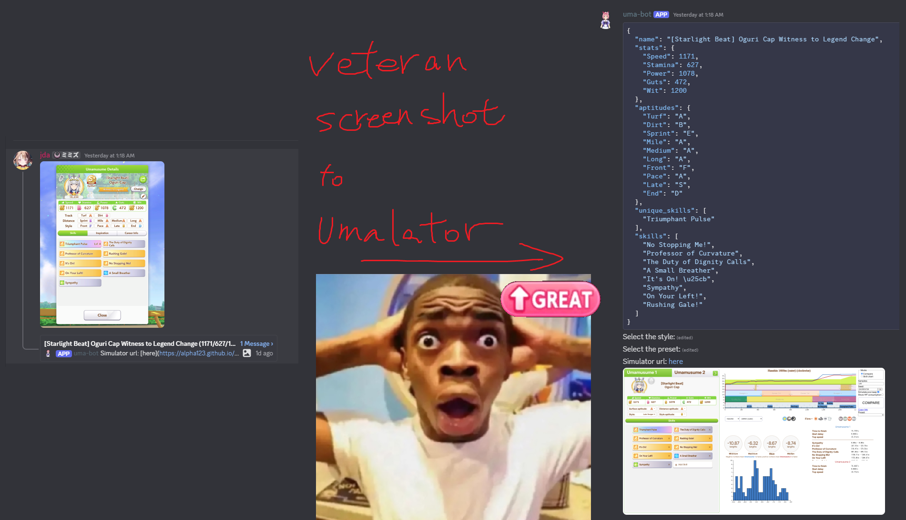

# Uma Club Helper Bot

A Discord bot for parsing veteran Umamusume screenshots and automatically running simulations with pre-filled data.

## Youtube Preview

https://www.youtube.com/watch?v=dNzNqTIrdrQ

[](https://www.youtube.com/watch?v=dNzNqTIrdrQ)

## Features

- **Veteran Screenshot Parsing**: Upload screenshots of veteran Umamusume characters to automatically extract character data (name, stats, skills, aptitudes) using OpenCV and PaddleOCR
- **Simulator Integration**: Automatically fills extracted data into the simulator and returns a pre-configured simulator URL
- **Club Management** (Legacy): Video processing and spreadsheet logging for club member tracking (Note: Club info tracking is now better handled by [chronogenesis.net](https://chronogenesis.net/))

## Setup

### Option 1: Docker Compose (Recommended)

1. Copy `example.env` to `production.env` and configure:
   - Discord bot credentials
   - PostgreSQL database URL

2. Run with Docker Compose:
   ```bash
   docker-compose up --build -d # using --build flag to prevent missing any updates
   ```

### Option 2: Docker

1. Copy `example.env` to `.env` and configure:
   - Discord bot credentials
   - PostgreSQL database URL

2. Build the Docker image:
   ```bash
   docker build -t uma-bot .
   ```

3. Run the container:
   ```bash
   docker run --env-file .env uma-bot
   ```

### Option 3: Manual Python Setup

1. Copy `example.env` to `.env` and configure:
   - Discord bot credentials
   - PostgreSQL database URL

2. Create and activate a virtual environment:
   ```bash
   python -m venv venv
   # On Windows:
   venv\Scripts\activate
   # On Linux/Mac:
   source venv/bin/activate
   ```

3. Install dependencies:
   ```bash
   pip install -r requirements.txt
   ```

4. Install Playwright browsers:
   ```bash
   playwright install --force --with-deps
   ```

5. Run the bot:
   ```bash
   python main.py
   ```

## Commands

### Basic

- `/ping` - Check if the bot is responsive

### Veteran Screenshot Processing

- `/setup-channel-veteran-uma` - Toggle current channel for processing veteran uma screenshots (requires administrator)

### Preset Management

- `/create-preset <name>` - Create a new simulator preset with track, length, ground, weather, and season settings
- `/list-presets` - List all custom presets
- `/delete-preset` - Delete an existing preset

### Club Management (Legacy)

- `/create-club <name>` - Create a new club (requires administrator)
- `/list-clubs` - List all clubs in this server (requires administrator)
- `/delete-club <name>` - Delete a club (requires administrator)
- `/setup-channel-club-records` - Toggle current channel as video upload destination for a club (requires administrator)

### Spreadsheet Integration (Legacy)

- `/enable-spreadsheet-logging <spreadsheet_id>` - Enable automatic Google Sheets logging for a club (requires administrator)
- `/disable-spreadsheet-logging` - Disable spreadsheet logging for a club (requires administrator)

### Development

- `/nuke-db` - [DEV] Drop and recreate all database tables (requires administrator, DEV environment only)

## Usage

### Veteran Screenshot Processing

1. Use `/setup-channel-veteran-uma` in a channel to enable screenshot processing
2. Upload one or two screenshots of veteran Umamusume characters to the configured channel
3. The bot will:
   - Parse the screenshot(s) to extract character name, stats (Speed/Stamina/Power/Guts/Wit), skills, and aptitudes
   - Create a thread for the analysis
   - Prompt you to select a running style (Front/Pace/Late/End) and simulator preset
   - Automatically fill the data into the simulator
   - Run the simulation and return a pre-configured simulator URL with a screenshot

The bot supports comparing two characters side-by-side when two screenshots are uploaded.

### Legacy Club Management

Upload a video recording of your Uma Musume club member list to a configured channel. The bot will automatically process the video, extract member information (names, fan counts, roles, last login), and update the associated Google Sheet with timestamped data.

Note: For club information tracking, [chronogenesis.net](https://chronogenesis.net/) provides a more convenient web-based solution.
